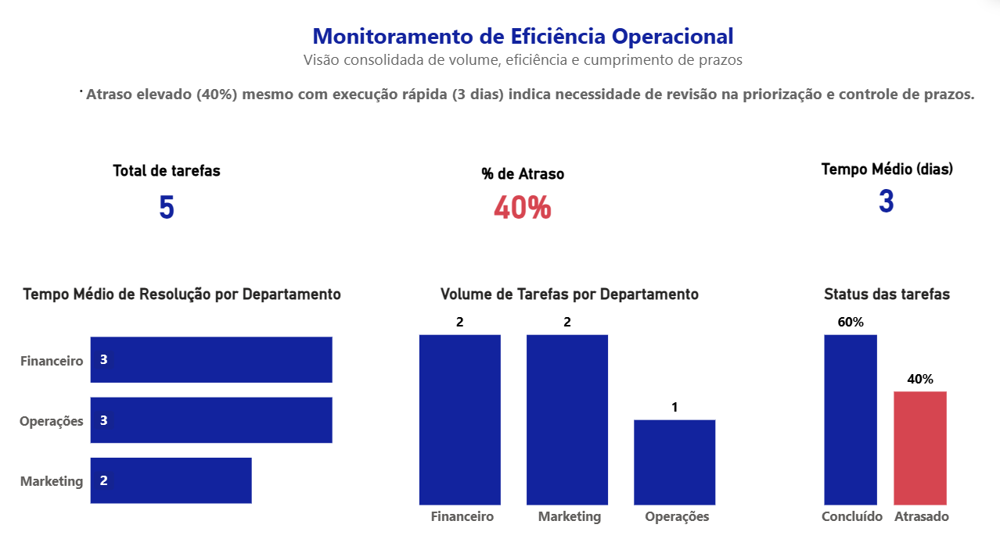

# Análise de Pendências Operacionais

## Contexto
Esse projeto nasceu de uma situação comum em operações: mesmo com um tempo médio de resolução relativamente baixo, ainda existe um volume alto de tarefas atrasadas.

A ideia aqui foi entender o que está por trás disso — não só olhando tempo médio, mas principalmente distribuição de demandas, acúmulo de backlog e padrões de atraso.

## Objetivo
Analisar as pendências operacionais para identificar gargalos no processo e gerar insights que ajudem na tomada de decisão e na melhoria do fluxo de trabalho.

## Principais Insights
- Cerca de **40% das tarefas estavam em atraso**
- Tempo médio de resolução de aproximadamente **3 dias**
- **Concentração de pendências em alguns usuários**
- Presença de **backlog acumulado**, mesmo com boa média de resolução

Na prática, isso mostra que o problema não está só em “quanto tempo leva”, mas em como o trabalho está distribuído e priorizado.

## Análise
Durante a exploração dos dados, alguns padrões chamaram atenção:

- tarefas distribuídas de forma desigual entre usuários  
- possíveis pontos de sobrecarga  
- falta de visibilidade sobre tarefas próximas do prazo  
- acúmulo em determinados períodos  

## Recomendações
Com base nisso, algumas ações que poderiam melhorar a operação:

- revisar a distribuição de tarefas entre os responsáveis  
- acompanhar backlog de forma mais frequente (ex: semanal)  
- criar alertas para tarefas próximas do vencimento  
- monitorar reincidência de atraso por usuário/área  
- revisar critérios de priorização  

## Como o projeto foi construído
- Tratamento e limpeza dos dados com **Python (ETL)**  
- Consultas e análises com **SQL**  
- Visualização dos indicadores no **Power BI**  

## Estrutura
- `data/raw` → dados brutos  
- `data/processed` → dados tratados  
- `python/` → scripts de tratamento e consulta  
- `dashboard/` → arquivo do Power BI  
- `docs/` → imagens e apoio visual  

## Próximos passos
- automatizar a atualização dos dados  
- criar acompanhamento contínuo dos indicadores  
- evoluir para análises preditivas de atraso  
- integrar com alguma ferramenta de monitoramento  

## Observação
O foco desse projeto não foi só a análise em si, mas principalmente traduzir dados em possíveis melhorias práticas para a operação.
